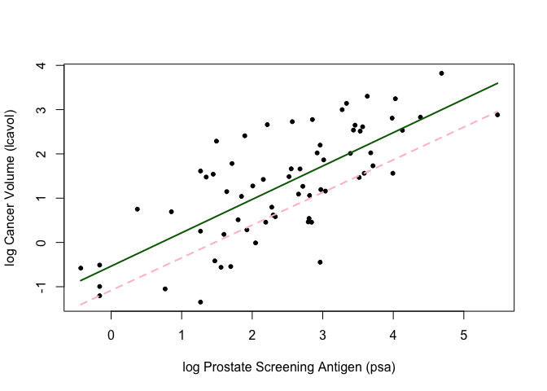
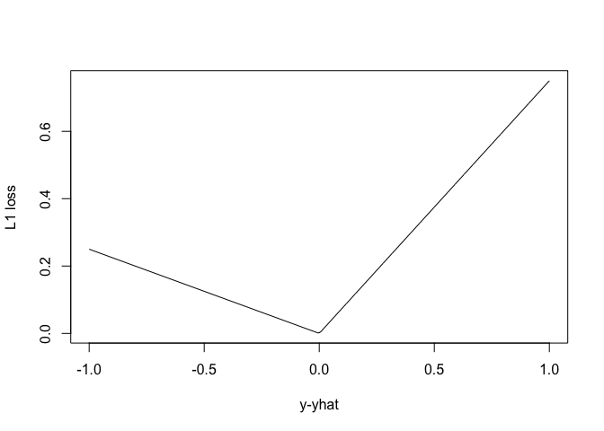
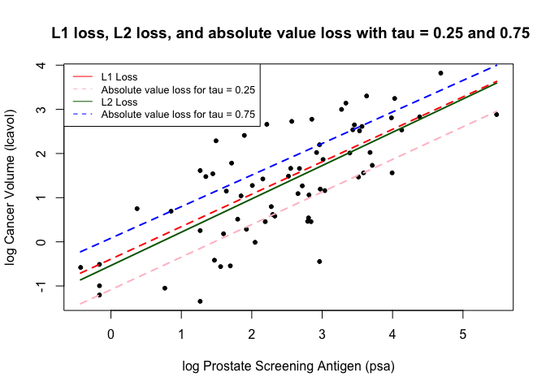

Homework2_Xiaoman_Xu
================
Xiaoman Xu
2023-01-23

# Source code

``` r
## load prostate data
prostate <- 
  read.table(url('https://web.stanford.edu/~hastie/ElemStatLearn/datasets/prostate.data'))

## subset to training examples
prostate_train <- subset(prostate, train==TRUE)

## plot lcavol vs lpsa
plot_psa_data <- function(dat=prostate_train) {
  plot(dat$lpsa, dat$lcavol,
       xlab="log Prostate Screening Antigen (psa)",
       ylab="log Cancer Volume (lcavol)",
       pch = 20)
}
plot_psa_data()

############################
## regular linear regression
############################

## L2 loss function
L2_loss <- function(y, yhat)
  (y-yhat)^2

## fit simple linear model using numerical optimization
##### what does this function mean
fit_lin <- function(y, x, loss=L2_loss, beta_init = c(-0.51, 0.75)) {
  err <- function(beta)
    mean(loss(y,  beta[1] + beta[2]*x))
  beta <- optim(par = beta_init, fn = err)
  return(beta)
}

## make predictions from linear model
predict_lin <- function(x, beta)
  beta[1] + beta[2]*x

## fit linear model
lin_beta <- fit_lin(y=prostate_train$lcavol,
                    x=prostate_train$lpsa,
                    loss=L2_loss)

## compute predictions for a grid of inputs
x_grid <- seq(min(prostate_train$lpsa),
              max(prostate_train$lpsa),
              length.out=100)
### NOTES: get the point with same difference


#### Isn't min(prostate_train$lpsa), max(prostate_train$lpsa) only have one number?

lin_pred <- predict_lin(x=x_grid, beta=lin_beta$par)

## plot data
plot_psa_data()

## plot predictions
lines(x=x_grid, y=lin_pred, col='darkgreen', lwd=2)

## do the same thing with 'lm'
lin_fit_lm <- lm(lcavol ~ lpsa, data=prostate_train)

## make predictins using 'lm' object
lin_pred_lm <- predict(lin_fit_lm, data.frame(lpsa=x_grid))
### how does 'predict' command work? 

## plot predictions from 'lm'
lines(x=x_grid, y=lin_pred_lm, col='pink', lty=2, lwd=2)
```

<!-- -->

``` r
##################################
## try modifying the loss function
##################################


#install.packages("qrnn")
library(qrnn)


## custom loss function
custom_loss <- function(y, yhat)
  qrnn::tilted.abs(y-yhat, tau = 0.25)

## plot custom loss function
err_grd <- seq(-1,1,length.out=200)
plot(err_grd, custom_loss(err_grd,0), type='l',
     xlab='y-yhat', ylab='custom loss')
```

<!-- -->

``` r
## fit linear model with custom loss
lin_beta_custom <- fit_lin(y=prostate_train$lcavol,
                    x=prostate_train$lpsa,
                    loss=custom_loss)

lin_pred_custom <- predict_lin(x=x_grid, beta=lin_beta_custom$par)

## plot data
plot_psa_data()

## plot predictions from L2 loss
lines(x=x_grid, y=lin_pred, col='darkgreen', lwd=2)

## plot predictions from custom loss
lines(x=x_grid, y=lin_pred_custom, col='pink', lwd=2, lty=2)
```

<!-- -->

# 1. Write functions that implement the L1 loss and tilted absolute loss functions.

``` r
L1_loss_tilted <- function(y, yhat, t){
  qrnn::tilted.abs(x=(y-yhat), tau=t)
}

err_grd <- seq(-1,1,length.out=200)
plot(err_grd, L1_loss_tilted(err_grd,0, 0.75), type='l',
     xlab='y-yhat', ylab='L1 loss')
```

<!-- -->

# 2. Create a figure that shows lpsa (x-axis) versus lcavol (y-axis). Add and label (using the ‘legend’ function) the linear model predictors associated with L2 loss, L1 loss, and tilted absolute value loss for tau = 0.25 and 0.75.

``` r
fit_lin_L1 <- function(y, x, loss=L1_loss_tilted, beta_init = c(-0.51, 0.75), t) {
  err <- function(beta)
    mean(loss(y,  beta[1] + beta[2]*x, t))
  beta <- optim(par = beta_init, fn = err)
  return(beta)
}


## fit linear model with custom loss
lin_beta_custom_25 <- fit_lin_L1(y=prostate_train$lcavol,
                    x=prostate_train$lpsa,
                    loss=L1_loss_tilted, t=0.25)

lin_pred_custom_25 <- predict_lin(x=x_grid, beta=lin_beta_custom_25$par)

lin_beta_custom_50 <- fit_lin_L1(y=prostate_train$lcavol,
                    x=prostate_train$lpsa,
                    loss=L1_loss_tilted, t=0.5)

lin_pred_custom_50 <- predict_lin(x=x_grid, beta=lin_beta_custom_50$par)

lin_beta_custom_75 <- fit_lin_L1(y=prostate_train$lcavol,
                    x=prostate_train$lpsa,
                    loss=L1_loss_tilted, t=0.75)

lin_pred_custom_75 <- predict_lin(x=x_grid, beta=lin_beta_custom_75$par)

## plot data
plot_psa_data()

## plot predictions from L2 loss
lines(x=x_grid, y=lin_pred, col='darkgreen', lwd=2)

## plot predictions from custom loss
lines(x=x_grid, y=lin_pred_custom_25, col='pink', lwd=2, lty=2)
lines(x=x_grid, y=lin_pred_custom_50, col='red', lwd=2, lty=2)
lines(x=x_grid, y=lin_pred_custom_75, col='blue', lwd=2, lty=2)

## create legend
legend("topleft",
       legend=c("L1 Loss","Absolute value loss for tau = 0.25", "L2 Loss", "Absolute value loss for tau = 0.75"),
       col=c("red","pink","darkgreen","blue"), lty = 1:2, cex=0.8)
title(main = " L1 loss, L2 loss, and absolute value loss with tau = 0.25 and 0.75")
```

<!-- -->

# 3.Write functions to fit and predict from a simple nonlinear model with three parameters defined by ‘beta\[1\] + beta\[2\]*exp(-beta\[3\]*x)’. Hint: make copies of ‘fit_lin’ and ‘predict_lin’ and modify them to fit the nonlinear model. Use c(-1.0, 0.0, -0.3) as ‘beta_init’.

``` r
## fit nonlinear model using numerical optimization
fit_nonlin_L2 <- function(y, x, loss=L2_loss, beta_init = c(-1.0, 0.0, -0.3)) {
  err <- function(beta)
    mean(loss(y,  beta[1] + beta[2]*exp(-beta[3]*x)))
  beta <- optim(par = beta_init, fn = err)
  return(beta)
}

## make predictions from nonlinear model
predict_nonlin<- function(x, beta)
  beta[1] + beta[2]*exp(-beta[3]*x)

## fit linear model
nonlin_beta <- fit_nonlin_L2(y=prostate_train$lcavol,
                    x=prostate_train$lpsa,
                    loss=L2_loss)

## compute predictions for a grid of inputs
x_grid <- seq(min(prostate_train$lpsa),
              max(prostate_train$lpsa),
              length.out=100)

nonlin_pred <- predict_nonlin(x=x_grid, beta=nonlin_beta$par)

## plot data
plot_psa_data()

## plot predictions
lines(x=x_grid, y=nonlin_pred, col='darkgreen', lwd=2)
```

<!-- -->

# 4. Create a figure that shows lpsa (x-axis) versus lcavol (y-axis). Add and label (using the ‘legend’ function) the nonlinear model predictors associated with L2 loss, L1 loss, and tilted absolute value loss for tau = 0.25 and 0.75.

``` r
## Rewrite function to make L1 has tau value
fit_nonlin_L1 <- function(y, x, loss=L1_loss_tilted, beta_init = c(-1.0, 0.0, -0.3), t) {
  err <- function(beta)
    mean(loss(y,  beta[1] + beta[2]*exp(-beta[3]*x), t))
  beta <- optim(par = beta_init, fn = err)
  return(beta)
}


## fit nonlinear model with custom loss
nonlin_beta_custom_25 <- fit_nonlin_L1(y=prostate_train$lcavol,
                    x=prostate_train$lpsa,
                    loss=L1_loss_tilted, t = 0.25)

nonlin_pred_custom_25 <- predict_nonlin(x=x_grid, beta=nonlin_beta_custom_25$par)

nonlin_beta_custom_75 <- fit_nonlin_L1(y=prostate_train$lcavol,
                    x=prostate_train$lpsa,
                    loss=L1_loss_tilted, t=0.75)

nonlin_pred_custom_75 <- predict_nonlin(x=x_grid, beta=nonlin_beta_custom_75$par)


## Rewrite function to make L1 not have tau value
# fit_nonlin_L1_pure <- function(y, x, loss=L1_loss_tilted, beta_init = c(-1.0, 0.0, -0.3)) {
#   err <- function(beta)
#     mean(loss(y,  beta[1] + beta[2]*exp(-beta[3]*x)))
#   beta <- optim(par = beta_init, fn = err)
#   return(beta)
# }
# 
# L1_loss <- function(y, yhat)
#   abs(y-yhat)

# nonlin_beta_L1<- fit_nonlin_L1(y=prostate_train$lcavol,
#                     x=prostate_train$lpsa,
#                     loss=L1_loss)
# 
# nonlin_pred_L1 <- predict_nonlin(x=x_grid, beta=nonlin_beta_L1$par)

nonlin_beta_L1<- fit_nonlin_L1(y=prostate_train$lcavol,
                    x=prostate_train$lpsa,
                    loss=L1_loss_tilted, t = 0.5)

nonlin_pred_L1 <- predict_nonlin(x=x_grid, beta=nonlin_beta_L1$par)


## plot data
plot_psa_data()

## plot predictions from L2 loss
lines(x=x_grid, y=nonlin_pred, col='darkgreen', lwd=2)

## plot predictions from custom loss
lines(x=x_grid, y=nonlin_pred_custom_25, col='pink', lwd=2, lty=2)
lines(x=x_grid, y=nonlin_pred_custom_75, col='blue', lwd=2, lty=2)

## plot predictions from L1 loss
lines(x=x_grid, y=nonlin_pred_L1, col='red', lwd=2)

## create legend
legend("topleft",
       legend=c("L1 Loss","Absolute value loss for tau = 0.25", "L2 Loss", "Absolute value loss for tau = 0.75"),
       col=c("red","pink","darkgreen","blue"), lty = 1:2, cex=0.8)
title(main = " L1 loss, L2 loss, and absolute value loss with tau = 0.25 and 0.75")
```

<!-- -->
