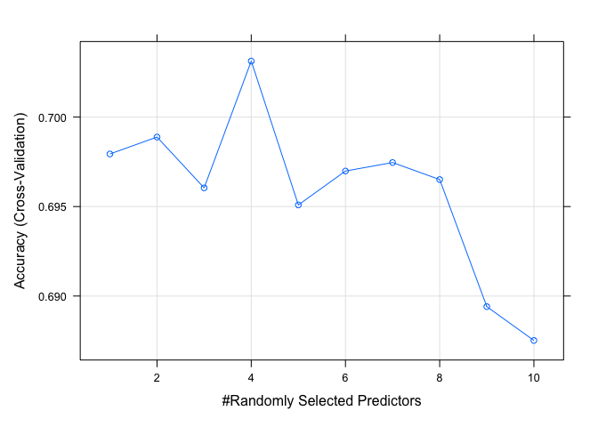

ML_HW5
================
Xiaoman Xu
2023-04-04

\#Goal: Understand and implement a random forest classifier. \#Using the
“vowel.train” data, develop a random forest (e.g., using the
“randomForest” package) or gradient boosted classifier for the vowel
data. \# 1. Fit a random forest or gradient boosted model to the
“vowel.train” data using all of the 11 features using the default values
of the tuning parameters. \# 2. Use 5-fold CV to tune the number of
variables randomly sampled as candidates at each split if using random
forest, or the ensemble size if using gradient boosting. \# 3. With the
tuned model, make predictions using the majority vote method, and
compute the misclassification rate using the ‘vowel.test’ data.

``` r
library('magrittr') ## for '%<>%' operator
library('dplyr')
```

    ## 
    ## Attaching package: 'dplyr'

    ## The following objects are masked from 'package:stats':
    ## 
    ##     filter, lag

    ## The following objects are masked from 'package:base':
    ## 
    ##     intersect, setdiff, setequal, union

``` r
library('rpart')
#install.packages('partykit')
library('partykit')
```

    ## Loading required package: grid

    ## Loading required package: libcoin

    ## Loading required package: mvtnorm

``` r
library('utils')
library('manipulate')
#install.packages('randomForest')
library('randomForest')
```

    ## randomForest 4.7-1.1

    ## Type rfNews() to see new features/changes/bug fixes.

    ## 
    ## Attaching package: 'randomForest'

    ## The following object is masked from 'package:dplyr':
    ## 
    ##     combine

``` r
library(caret)
```

    ## Loading required package: ggplot2

    ## 
    ## Attaching package: 'ggplot2'

    ## The following object is masked from 'package:randomForest':
    ## 
    ##     margin

    ## Loading required package: lattice

``` r
#install.packages('xgboost')
library('xgboost')
```

    ## 
    ## Attaching package: 'xgboost'

    ## The following object is masked from 'package:dplyr':
    ## 
    ##     slice

``` r
library('tidyverse')
```

    ## ── Attaching packages
    ## ───────────────────────────────────────
    ## tidyverse 1.3.2 ──

    ## ✔ tibble  3.1.8     ✔ purrr   0.3.5
    ## ✔ tidyr   1.2.1     ✔ stringr 1.4.1
    ## ✔ readr   2.1.2     ✔ forcats 0.5.1
    ## ── Conflicts ────────────────────────────────────────── tidyverse_conflicts() ──
    ## ✖ randomForest::combine() masks dplyr::combine()
    ## ✖ tidyr::extract()        masks magrittr::extract()
    ## ✖ dplyr::filter()         masks stats::filter()
    ## ✖ dplyr::lag()            masks stats::lag()
    ## ✖ purrr::lift()           masks caret::lift()
    ## ✖ ggplot2::margin()       masks randomForest::margin()
    ## ✖ purrr::set_names()      masks magrittr::set_names()
    ## ✖ xgboost::slice()        masks dplyr::slice()

``` r
#install.packages('gpairs')
library('gpairs')   ## pairs plot
library('viridis')  ## viridis color palette
```

    ## Loading required package: viridisLite

``` r
library('caret')
library('corrplot')
```

    ## corrplot 0.92 loaded

``` r
library('ggplot2')
```

# Import the training and testing data

``` r
df_train <- read_csv(url('https://hastie.su.domains/ElemStatLearn/datasets/vowel.train'))
```

    ## Rows: 528 Columns: 12
    ## ── Column specification ────────────────────────────────────────────────────────
    ## Delimiter: ","
    ## dbl (12): row.names, y, x.1, x.2, x.3, x.4, x.5, x.6, x.7, x.8, x.9, x.10
    ## 
    ## ℹ Use `spec()` to retrieve the full column specification for this data.
    ## ℹ Specify the column types or set `show_col_types = FALSE` to quiet this message.

``` r
df_test <- read.csv(url('https://hastie.su.domains/ElemStatLearn/datasets/vowel.test'))
```

``` r
df_train <- df_train %>% 
  select(-row.names) %>% 
  mutate(y = as.factor(y))

df_test <- df_test %>% 
  select(-row.names) %>% 
  mutate(y = as.factor(y))

#get the training and testing data
x_train <- df_train[,2:11]
y_train <- df_train[,1]

x_test <- df_test[,2:11]
y_test <- df_test[,1]
```

# 1. Fit a random forest or gradient boosted model to the “vowel.train” data using all of the 11 features using the default values of the tuning parameters.

``` r
# Fit a random forest model using all 11 features
rf_model <- randomForest(y ~ ., data=df_train)
```

# 2. Use 5-fold CV to tune the number of variables randomly sampled as candidates at each split if using random forest, or the ensemble size if using gradient boosting.

``` r
# mtry parameter (i.e., the number of variables randomly sampled as candidates at each split) when fitting a random forest model

set.seed('123')
vowel_folds  <- createFolds(df_train$y, k=5)
#print(vowel_folds)
sapply(vowel_folds, length)  
```

    ## Fold1 Fold2 Fold3 Fold4 Fold5 
    ##   104   106   106   106   106

``` r
# Set up the 5-fold cross-validation scheme
ctrl <- trainControl(method = "cv", number = 5, index = vowel_folds)

# Set up the tuning parameters for mtry
tuneGrid <- expand.grid(mtry = seq(1, ncol(df_train) - 1, by = 1))


# Fit the random forest model with 5-fold CV to tune mtry
rf_fit <- train(y ~ ., 
                data = df_train, 
                #y_train, 
                method = "rf", 
                metric = "Accuracy", 
                trControl = ctrl,
                tuneGrid =  tuneGrid
                )


# Print the best value of mtry
print(rf_fit$bestTune$mtry)
```

    ## [1] 4

``` r
plot(rf_fit)
```

<!-- -->

# 3. With the tuned model, make predictions using the majority vote method, and compute the misclassification rate using the ‘vowel.test’ data.

``` r
# Make predictions on the test data using the majority vote method
rf_pred <- predict(rf_model, x_test)

# Compute the misclassification rate
misclassification_rate <- sum(rf_pred != y_test) / length(y_test)
print(paste("Misclassification rate:", round(misclassification_rate, 4)))
```

    ## [1] "Misclassification rate: 0.4091"
